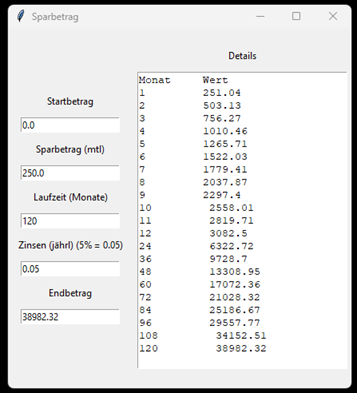

# Sparbetrag
Hier kann man die erwartbaren Zinsen bei einem festen Sparbetrag berechen und visualisieren lassen.
Das Programm wird auf Windows 10 und Windows 11 getestet. Linux wird später folgen. 
 
Die folgenden Releases sind verfügbar:
- V1.0: Erste releaste Version. Nur Kommanzozeilennutzung enthalten
- V2.0: Zweite release Version. Eine grafische Benutzeroberflaäche ist enthalten. Benutze "ESC" um das Programm zu beenden und "Tab" oder "Enter" um eingegebene Werte zu berechnen.
 
 
Bild der Benutzeroberfläche:

 

### So kann man in der Kommandozeile schnell per Notepad++ eine Datei des Ordners ändern:
`.\edit.ps1 Sparbetrag_GUI.py`
